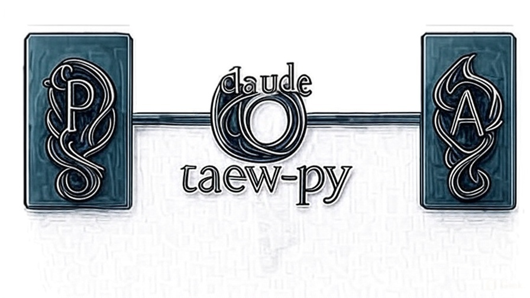

# claude-taew-py

Claude Code CLI plugin for AI-assisted development with [taew-py](https://github.com/asterkin/taew-py) Ports & Adapters foundation library.

The name **taew** comes from the Elvish word for "socket" - a [programmable port](https://www.elfdict.com/w/taew) that adapts to different needs.

## Quick Start

> **🚧 Under Construction**
>
> Plugin distribution and installation mechanisms are under development. Current skills (doc-query, add-doc, adr) are functional in development mode.
>
> **To try now:** See [CONTRIBUTING.md](CONTRIBUTING.md) for development setup
>
> **Roadmap:** See [VISION.md](VISION.md) for planned features

## Documentation

- **[VISION.md](VISION.md)** - Strategic goals, project philosophy, and roadmap
- **[CONTRIBUTING.md](CONTRIBUTING.md)** - Development setup and contribution guidelines
- **[docs/adrs/](docs/adrs/)** - Architecture decision records
- **[CLAUDE.md](CLAUDE.md)** - AI assistant operational instructions

## Who Is This For?

This plugin supports:
- **Application developers** building software with taew-py
- **Adapter developers** creating 3rd-party technology adapters
- **Core maintainers** contributing to taew-py itself

For detailed use cases and philosophy, see [VISION.md - Target Users & Use Cases](VISION.md#target-users--use-cases).

## Core Philosophy

taew-py architectural principles:
- **taew-py core**: Stays at Python stdlib level (language extension)
- **3rd-party adapters**: Separate projects (AWS, GCP, PostgreSQL, etc.)
- **Dynamic-first**: Dynamic wiring by default, static as deployment optimization
- **CLI-first**: Easiest path to explore workflows, then extend to TUI/Web/etc.

For AI-native architecture and evolution path, see [VISION.md - AI-Native Architecture](VISION.md#ai-native-architecture).

## Contributing

Interested in contributing? See [CONTRIBUTING.md](CONTRIBUTING.md) for setup instructions, including how to configure the required Context7 API key for accessing up-to-date Python 3.14+ and Claude Code CLI documentation.

Please note that this project is released with a [Code of Conduct](CODE_OF_CONDUCT.md). By participating in this project you agree to abide by its terms.

## License

[MIT](LICENSE)
